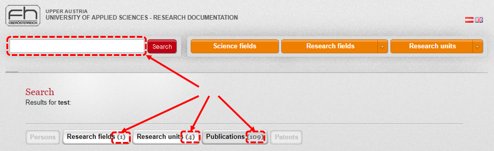

# Testing Web-Applications with Selenium

In this assignment you learn how to build a maintainable test framework for testing web applications using JUnit and the [Selenium WebDriver][SeleniumHQ WebDriver]. Starting with a simple Selenium based test you will gradually improve the code to get a test system with abstraction layer, reusable functions and a separate test data pool.

## (1) Automated Web Testing using Selenium IDE _(1 Point)_

In this exercise you learn the basics of automated web testing via record and replay. We use [Selenium IDE][] for this.

### Prerequisites

- [x] A current version of either Firefox or Chrome web browser.

### Instructions

1. Install Selenium IDE as extension to your browser (install either [Selenium IDE for Firefox][] or [Selenium IDE for Chrome][]).
1. Load the Selenium IDE project [`src/side/Widok Test.side`](src/side/Widok%20Test.side) into your Selenium IDE.

   This project contains two test cases that perform checks on the _University of Applied Science's Research Documentation web page_ ("Widok") located at http://research.fh-ooe.at.

1. Add **two** additional test cases
   1. Create a test case that test - similar to `WidokGermanTest` - the english translation of the search page. Name it `WidokEnglishTest`.
      _(Hint: Click on the small Union Jack in the top right corner of the page to get the english version.)_
         
   1. Create a test case that performs a search and tests if the first research unit found is linked to the correct details page of this research unit (e.g. the heading of the details page is correct). Name this test `WidokSearchResultTest`.
   
   You can either record this test or create it manually in the command editor of the Selenium IDE.
   
   In case of recording, make sure to clean up the test cases afterwards to get rid of unwanted commands that may have been recorded accidentially.

1. Run all tests and make sure they complete sucessfully.

### Submission

When you're done...

- [x] push your changes to your upstream repository on GitHub.
- [x] on GitHub, [create a release][GitHub creating releases] with version `v1.0`.
- [x] upload the [link to your release][GitHub linking to releases] on the e-learning platform until the specified date and time before the next lecture.
- [x] please assess this exercise:

  | Category                                |       |
  | :-------------------------------------- | :---: |
  | Time expenses for this exercise         | hh:mm |
  | Difficulty (1=:sunglasses:, 5=:scream:) |  1-5  |
  | Fun (1=:heart_eyes:, 5=:tired_face:)    |  1-5  |
  
## (2) JUnit Test using Selenium WebDriver _(2 Points)_

The goal of this exercise is to learn how to write a simple system test for a web application as JUnit test cases in Java using the Selenium WebDriver. The test cases we implement are those of the previous exercise.

### Prerequisites

- [x] Completion of the previous exercise (1).
- [x] Java 10 SDK. (Works also with other versions, but this requires slight modifications of [`pom.xml`](pom.xml).)
- [x] Maven 3. (If you use an IDE like Eclipse or IntelliJ, Maven is **already included** :sunglasses:.)

### Instructions

1. This git repository is a [Maven Project][]. Import it into/Open it in your favourite IDE (e.g. Eclipse, IntelliJ).

   The required libraries _Unit_, _Selenium WebDriver_ (and two more) are already set up as Maven dependencies. So you do not have to download or install anything, your IDE will locate and download them for you.
   If you prefer to **not** use an IDE, you can use the Maven command line tool _mvn_ to compile and package your classes and execute your tests. 
   
1. Take the existing class [`at.fhhagenberg.sqe.widok.WidokTest`](src/test/java/at/fhhagenberg/sqe/widok/WidokTest.java) as starting point to write a system test with JUnit and Selenium WebDriver. Implement all of the _four tests of the previous exercise (1)_:

   1. `testWidokGerman`: Ensure, the default search page is correctly translated to german.
   1. `testWidokEnglish`: Ensure, the english search page is correctly translated to english.
   1. `testWidokSearch`: Search for 'test' and check if the first publication has the title _"Testen von Web-Anwendungen"_;
   1. `testWidokSearchResult`: Perform a search and test if the first research unit found is linked to the correct details page of this research unit.

1. Run all your tests and make sure they complete successfully.

### Submission
When you're done...

- [x] push your changes to your upstream repository on GitHub.
- [x] on GitHub, [create a release][GitHub creating releases] with version `v2.0`.
- [x] upload the [link to your release][GitHub linking to releases] on the e-learning platform until the specified date and time before the next lecture.
- [x] please assess this exercise:

  | Category                                |       |
  | :-------------------------------------- | :---: |
  | Time expenses for this exercise         | hh:mm |
  | Difficulty (1=:sunglasses:, 5=:scream:) |  1-5  |
  | Fun (1=:heart_eyes:, 5=:tired_face:)    |  1-5  |
  
## (3) Page Objects _(2 Points)_

In this exercise you learn how to extend automated testing of (Web-based) GUIs to increase the maintainability and flexibility of your test implementation.

The test code written in the previous example has no abstractions and is therefore not well maintainable, especially when the page structure changes in a future version. Therefore, we want to create a more abstract domain-specific Test-API for the Widok web page to be able to write "high-level" tests that do not break on minor changes of the web page.

### Prerequisites

- [x] Completion of the previous exercise (2).
- [x] Java 10 SDK. (Works also with other versions, but this requires slight modifications of [`pom.xml`](pom.xml).)
- [x] Maven 3. (If you use an IDE like Eclipse or IntelliJ, Maven is **already included** :sunglasses:.)

### Instructions

Read the blog entry [Page Objects in Selenium][] about the use of the 'Page Objects' test pattern and refactor the test scripts from the previous exercise into `WidocPageObjectsTest.java`.

The test cases should be independent from finding elements, clicks, key strokes, etc. operating on specific elements of a Web page. These operations and specific elements should be moved to Page Object classes `SearchPage`, `ResultsPage`, etc. Put these classes into a separate package (e.g. `at.fhhagenberg.sqe.widok.pages`).

Note:
* Follow the examples provided at [Page Objects in Selenium] and [SeleniumHQ Wiki about PageObjects][SeleniumHQ Wiki PageObjects]. 
* Use the class `PageFactory` provided by Selenium to abbreviate the code in the Page Object classes. For further information see the aforementioned blog as well as the [Wiki documentation about PageFactories][SeleniumHQ Wiki PageFactory].
* Run your JUnit test cases – make sure they still pass.

### Submission

When you're done...

- [x] push your changes to your upstream repository on GitHub.
- [x] on GitHub, [create a release][GitHub creating releases] with version `v3.0`.
- [x] upload the [link to your release][GitHub linking to releases] on the e-learning platform until the specified date and time before the next lecture.
- [x] please assess this exercise:

  | Category                                |       |
  | :-------------------------------------- | :---: |
  | Time expenses for this exercise         | hh:mm |
  | Difficulty (1=:sunglasses:, 5=:scream:) |  1-5  |
  | Fun (1=:heart_eyes:, 5=:tired_face:)    |  1-5  |
  
## (4) Data-driven Tests _(2 Points)_

The implemented test cases contain test code and test data. In this exercise you learn how to to increase the flexibility and maintainability of the tests by separating test data from test code.

### Prerequisites

- [x] Completion of the previous exercise (3).
- [x] Java 10 SDK. (Works also with other versions, but this requires slight modifications of [`pom.xml`](pom.xml).)
- [x] Maven 3. (If you use an IDE like Eclipse or IntelliJ, Maven is **already included** :sunglasses:.)

### Instructions

1. First, check http://junit.sourceforge.net/javadoc/org/junit/runners/Parameterized.html on details about JUnit’s support for parameterized test cases.

1. Create a parameterized JUnit `WidokParameterizedSearchTest.java` test to repeat the following scenario
   1. Search for a term (e.g. 'testing') and
   1. Check the number of found persons, research fields, publications, etc.

Please, write your test case according to following instructions:
* Create a parameterized test that uses the page objects written in the previous exercise (3).
* Provide a list of search terms (e.g., "embedded", "software", "testing") and expected result numbers (e.g. "47", "11", ...) as parameter set; the parameterized test iterates over this parameter set.

### Submission

When you're done...

- [x] push your changes to your upstream repository on GitHub.
- [x] on GitHub, [create a release][GitHub creating releases] with version `v4.0`.
- [x] upload the [link to your release][GitHub linking to releases] on the e-learning platform until the specified date and time before the next lecture.
- [x] please assess this exercise:

  | Category                                |       |
  | :-------------------------------------- | :---: |
  | Time expenses for this exercise         | hh:mm |
  | Difficulty (1=:sunglasses:, 5=:scream:) |  1-5  |
  | Fun (1=:heart_eyes:, 5=:tired_face:)    |  1-5  |
  
[GitHub creating releases]: https://help.github.com/articles/creating-releases/
[GitHub linking to releases]: https://help.github.com/articles/linking-to-releases/
[Selenium IDE]: https://www.seleniumhq.org/docs/02_selenium_ide.jsp
[Selenium IDE for Firefox]: https://addons.mozilla.org/en-US/firefox/addon/selenium-ide/
[Selenium IDE for Chrome]: https://chrome.google.com/webstore/detail/selenium-ide/mooikfkahbdckldjjndioackbalphokd
[Maven Project]: https://maven.apache.org/guides/getting-started/
[Page Objects in Selenium]: http://blog.activelylazy.co.uk/2011/07/09/page-objects-in-selenium-2-0/
[SeleniumHQ WebDriver]: https://www.seleniumhq.org/projects/webdriver/
[SeleniumHQ Wiki PageObjects]: https://github.com/SeleniumHQ/selenium/wiki/PageObjects
[SeleniumHQ Wiki PageFactory]: https://github.com/SeleniumHQ/selenium/wiki/PageFactory
